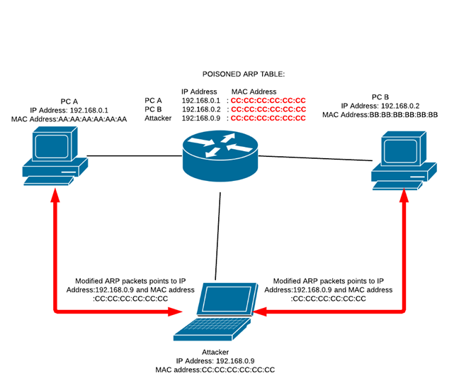

Envenenamiento ARP
------------------

El envenenamiento ARP o ARP spoofing es un tipo de ataque realizado sobre una red de área local (LAN). El ataque consiste en enviar paquetes ARP maliciosos a la puerta de enlace o a la máquina víctima para envenenar las tablas ARP, encargadas de traducir una dirección MAC a una dirección IP. Si no se traducen de forma correcta estas direcciones ni el router ni la máquina serán capaces de mandar correctamente paquetes a su destino, dejando a la víctima sin servicio de red.

Debido a que el protocolo ARP está enfocado a la eficiencia y no a la seguridad, los ataques de envenenamiento de ARP son extremadamente fáciles de llevar a cabo, siempre que el atacante esté en la misma red de área local que la víctima.

Normalmente este ataque se utiliza en combinación con ataques Man-in-the-Middle, para capturar el tráfico de la víctima e incluso para introducir tráfico falso. A la hora de realizar el ataque de denegación de servicio podremos interceptar el tráfico legítimo y descartar todos los paquetes, o introducir direcciones falsas en la red para que los paquetes enviados nunca sean recibidos por una máquina o router legítimos.

Descripción del ataque
----------------------

**TODO** Como se realiza el ARP spoof (gratuitous arp)

Dos formas de realizarlo  
- Direcciones falsas  
- En medio y descartar

**TODO** hacer fotos para estos casos

The attack itself consists of an attacker sending a false ARP reply message to the default network gateway, informing it that his or her MAC address should be associated with his or her target's IP address (and vice-versa, so his or her target's MAC is now associated with the attacker's IP address). Once the default gateway has received this message and broadcasts its changes to all other devices on the network, all of the target's traffic to any other device on the network travels through the attacker's computer, allowing the attacker to inspect or modify it before forwarding it to its real destination. Because ARP Poisoning attacks occur on such a low level, users targeted by ARP Poisoning rarely realize that their traffic is being inspected or modified.

Pertenece a la capa de enlace.

Mitigación
----------

**TODO**  
Tablas ARP estáticas  
Detectores de ARP spoof  
No aceptar ARP no solicitado

Referencias
-----------

https://security.radware.com/ddos-knowledge-center/ddospedia/arp-poisoning/

https://en.wikipedia.org/wiki/ARP_spoofing
