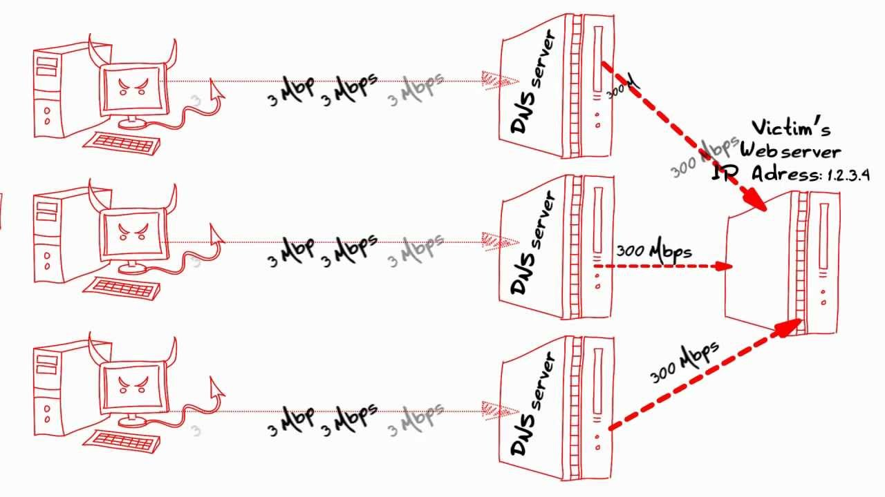
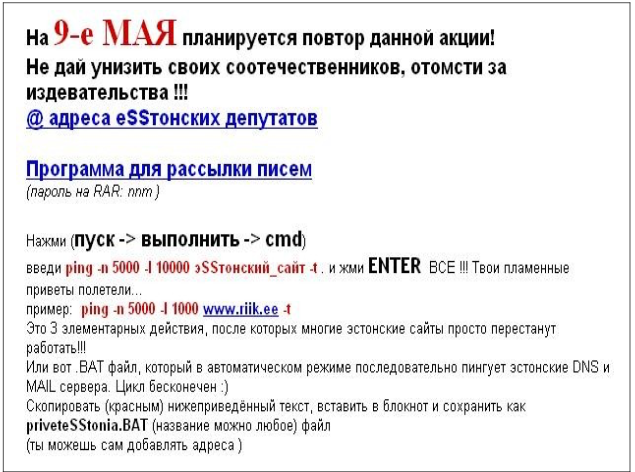
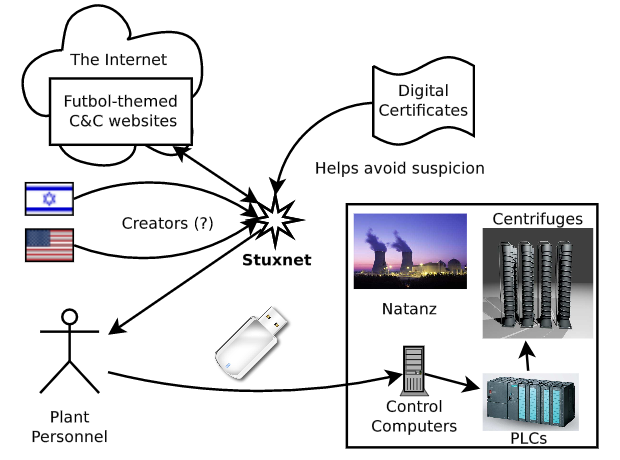
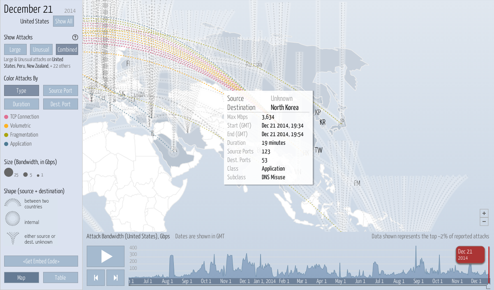

Historia de los ataques DoS
===========================

Durante los últimos años hemos sido testigos de un gran número de ataques de denegación de servicio organizados. La mayor parte de estos ataques proviene de hacktivistas, organizaciones criminales o incluso gobiernos.

Estos ataques se han hecho cada vez más profesionales y más efectivos. Desde 1999 que se tiene constancia del primer ataque de denegación de servicio distribuido, contra la universidad de Minnesota, utilizando una botnet formada por 227 máquinas (Garber 2000); hasta hoy en día, con ataques como el de la botnet Mirai, al servidor DNS Dyn, formada por casi 50.000 máquinas. (https://www.incapsula.com/blog/malware-analysis-mirai-ddos-botnet.html\)

Primeros años (1988 - 1999)
---------------------------

Podemos considerar el primer ataque de denegación de servicio al gusano Morris, en 1988. Creado por Robert Tappan Morris, estudiante de la universidad de Cornell, EEUU. El ataque estaba basado en un programa que se autoreplicaba (gusano) y no en una botnet, como la mayoría de ataques modernos. El objetivo del ataque, según el autor, era calibrar el tamaño de la red, aunque causó una denegación de servicio al 10% (60.000 máquinas) de lo que para entonces la red de telecomunicaciones global, ARPANET, precursora de Internet. El gusano se extendía a través de la explotación de vulnerabilidades en UNIX o a través de contraseñas débiles. Como resultado de este ataque, se fundó en 1988 el centro de coordinación del CERT (CERT/CC), diseñado para proporcionar un punto central para coordinar los distintos equipos de respuesta de emergencia. (https://security.radware.com/ddos-knowledge-center/ddospedia/morris-worm/)  
(https://en.wikipedia.org/wiki/Morris_worm/\)

Respecto a los ataques realizados por botnets, es difícil encontrar cuál fue el primer ataque DDoS a gran escala. Encontramos diferentes artículos del CERT (Computer Emergency Response Team) del año 1996 que ya describen la aparición de diversos ataques distribuidos ese mismo año. (https://www.cert.org/historical/advisories/CA-1996-01.cfm) (https://www.cert.org/historical/advisories/CA-1996-21.cfm\)

El primero de ellos se basa en tomentas de paquetes UDP, creadas mediante la comunicación UDP entre 2 puertos de una o varias máquinas. Cada uno de los puertos UDP genera una salida que se redirige al otro puerto emisor, dando lugar a grandes cantidades de paquetes en la red. El segundo se basa en saturar un host a base de conexiones TCP SYN medio abiertas, ataque conocido como inundación TCP SYN (TCP SYN flood).

También en 1996 apareció el primer exploit basado en el ping de la muerte, capaz de tumbar servidores con un único paquete ICMP *echo request* (ping) malformado. (https://web.archive.org/web/19981205161708/http://www.sophist.demon.co.uk:80/ping/latest.html\)

El primer ataque de denegación de servicio distribuido reportado, a gran escala en Internet, data de agosto de 1999. Se realizó contra la red de la universidad de Minnesota, EEUU. El ataque tumbó la red durante más de dos días. Se utilizó una botnet de 227 máquinas, entre las que había 114 que formaban parte de una red de alta velocidad y capacidad. (Garber 2000)

Por aquella época no eran muy conocidos estos ataques y no tenían mucha difusión. Aquellos que aparecían lo hacían en revistas *underground*. Tampoco había gran variedad de herramientas disponibles y la mayoría eran muy simples o solo pruebas de concepto.

Los primeros escenarios de prueba fueron los canales IRC (Internet Relay Chat). Estos canales de comunicación eran entornos controlados que permitián a los atacantes registrarse anónimamente y enviar mensajes de forma centralizada a las máquinas zombie de las botnets. Por esta razón muchas organizaciones y universidades dejaron de dar soporte a las redes IRC. (Goel, Baykal & Pon 2006)

*Esquema de una botnet utilizando un canal IRC*

El atacante solo necesita enviar los comandos de ataque al canal IRC, al que están conectados todos los bots. En la imagen anterior, el C&C

Investicación y pruebas (2000 - 2006)
-------------------------------------

En febrero del año 2000, durante 3 días, las principales sitios de Internet de la época sufrieron un ataque de denegación de servicio distribuido. Entre ellas se encontraban Yahoo, eBay, CNN Amazon o ZDNet. El autor del ataque fue un chico canadiense de 15 años apodado MafiaBoy. Se le consideró un *script kiddie*, ya que utilizó herramientas que no eran suyas y lanzó el ataque para obtener notoriedad. Utilizó un rootkit automático para infectar máquinas y varias herramientas de denegación de servicio basadas en inundar de tráfico la red realizó el ataque. (Genosko 2006)

Todo comenzó el día 7, con un ataque a Yahoo. Esta web fue la que tuvo mayor número de visitantes legítimos en enero de ese mismo año según Media Metrix, compañia especializada por aquel entonces en medir el tráfico online. Durante los 2 días restantes, otras páginas situadas en el top 50 de visitas únicas al día fueron víctimas del ataque, plataformas de comercio electrónico en su mayoría.

El ataque generó picos de tráfico de 1 gigabit por segundo, superior a lo que podían soportar los servidores, provocando que estuvieran caídos durante horas. Generó pérdidas monetarias en todos los comercios electrónicos afectados y aumentó la latencia de Internet en general. Según un estudio de Keynote Systems, un proveedor de Internet de la época, el día 9 de febrero Internet era un 26,8% más lento. (Garber 2000)

*Comparativa del tráfico durante el ataque y tras el ataque*

En 2005 y 2006 aparecen los primeros ataques DDoS que utilizan amplificación de DNS, aunque ya en 2002 se teorizó con este tipo de ataques, que permitían aumentar el tráfico enviado por un atacante de forma significativa utilizando la resolución de nombres de los servidores DNS. Se considera que estos ataques fueron simplemente pruebas para ver si funcionaban correctamente los ataques. (Vaughn & Evron 2006)

Los autores documentan que estos ataques generaros picos de tráfico de hasta 10Gbps utilizando 140.000 servidores DNS. Las peticiones DNS consistían en paquetes UDP con un tamaño de 60 bytes que podían generar respuestas de hasta 4000 bytes, lo que significa un factor de amplificación de 60.

*Funcionamiento de la amplificación de DNS*

Se pueden tener indicios que datan la creación de la herramienta LOIC en el año 2006, ya que ciertas cadenas de texto de la herramienta corresponden con memes de ese mismo año. LOIC o Low Orbit Ion Cannon, fue una herramienta de denegación de servicio muy utilizada por hacktivistas. Ponía en manos de cualquier persona la capacidad de realizar un ataque de denegación de servicio, sólo era necesario elegir el objetivo y establecer la velocidad de ataque. La herramienta permite un modo distribuido, conectando a un canal IRC el cliente para que reciba los comandos dende ahí.

En esta fase las técnicas siguen siendo básicas, pero se comienza a investigar y las herramientas empiezan a ser más avanzadas. Tanto que incluso un chico de 15 años pudo realizar un ataque a gran escala sin conocimientos de avanzados de informática. Sobretodo quedo en evidencia que muchas empresas y organizaciones no estaban preparadas ante el nuevo tipo de ataques de denegación de servicio.

Inicios del cibercrimen (2007 - 2012)
-------------------------------------

En esta etapa los cibercriminales descubren lo fácil, barato y efectivo que es ejecutar ataques de denegación de servicio, comenzando a monetizar de forma los mismos a través de la extorsión o utilizándolos para fines políticos o activistas.

En abril de 2007 se producen una serie de ataques DDoS coordinados contra Estonia, inundando los sitios web de las principales organizaciones y organismos, como el parlamento de Estonia, bancos, ministerios, periódicos y empresas de telecomunicaciones.

Se cree que el ataque fue parte de un conflicto político entre Estonia y Rusia, tras la ruptura de la unión soviética, debido a una propuesta en Estonia para recolocar una estatua de la segunda guerra mundial soviética ubicada en la ciudad de Tallín. Para las autoridades rusas la estatua simbolizaba la liberación de Tallín del nacismo por la URSS, para el gobierno local significaba la ocupación y opresión soviéticas durante medio siglo. La mayor parte del tráfico provenía de fuera del país y en los mensajes había claras indicaciones con motivación política, como insultos de fascista al primer ministro estono. (Ottis 2007)

*Instrucciones en ruso del ataque de 2007 a Estonia el 9 de Mayo*

El ataque tuvo lugar del 27 de abril al 18 de mayo y se utilizaron diferentes técnicas de denegación de servicio durante esos 22 días. Se utilizaron diversos métodos ya conocidos, como la inundación UDP, inundación ICMP, peticiones HTTP malformadas, spam de correo, etc. Los objetivos principales fueron servidores DNS, servidores de correo y servidores web.

Se le considera uno de los primeros ataques de ciberguerra ocurridos en el mundo, aunque no se le atribuyó la culpa a Rusia al final, sino a un ciudadano ruso viviendo en Estonia. Tras los ataques se comenzó el desarrollo de una política de ciberdefensa en el país y se creó el centro de de excelencia para la ciberseguridad de la OTAN en el 2008.

**TODO**

-	Pushdo botnet / Pandex Botnet 2007 (botnets) https://security.radware.com/ddos-knowledge-center/ddospedia/pushdo-botnet/ https://security.radware.com/ddos-knowledge-center/ddospedia/pandex-botnet/

En el año 2009 se publica el código original del ataque Slowloris, que provocaba una denegación de servicio a nivel de aplicación muy dirigida a páginas web utilizando un tráfico mínimo.

Durante las protestas por las elecciones presidenciales de Irán, en 2009, Anonymous utilizó este ataque de denegación de servicio contra diversos sitios que pertenecían al gobierno iraní. Se eligió este ataque, sobre otros basados en saturar la red hacía la herramienta LOIC, debido a que estos segundos podían afectar tanto a las webs del gobierno como a las webs de los manifestantes. Al elegir este ataque el impacto fue más focalizado e implicaba un menor consumo de ancho de banda.

*Ataques de 2009 por Anonymous Iran* (Anonymous Iran 2007)

**TODO**

-	Operation Payback 2010 (anon) https://security.radware.com/ddos-knowledge-center/ddospedia/operation-payback/

En esta época el precio de las botnets esta tirado http://www.zdnet.com/article/study-finds-the-average-price-for-renting-a-botnet/

También en 2010 ocurrió un ataque de denegación de servicio disruptivo con consecuencias severas para el programa nuclear de Irán. Se identificó un gusano llamado Stuxnet que tenía como principal objetivo los controladores lógicos programables (PLCs), que forman parte principalmente de los sistemas industriales. Este gusano se expandió principalmete en Irán, llegando a ser un 60% de las máquinas infectadas de este país. Se cree que el gusano fue desarrollado por el gobierno de Estados Unidos y el de Israel. (Sangerjune 2012)

El ataque estaba diseñado para cambiar la velocidad de rotación del motor, primero acelerándola y luego decelerándola, para así generar vibraciones excesivas que destruyeran las centrifugadoras de la planta nuclear. Llegaron a destruirse más de 1000 centrifugadoras, con ello se consiguió retrasar muchos años el programa nuclear de Irán. (Mueller & Yadegari 2012)

*Visión general de Stuxnet*

**TODO**

-	Operation blackout 2012 (anon) https://security.radware.com/ddos-knowledge-center/ddospedia/operation-blackout/

-	Operation Defense 2012 (anon) https://security.radware.com/ddos-knowledge-center/ddospedia/operation-defense/

-	OPIsrael 2012 (anon) https://security.radware.com/ddos-knowledge-center/ddospedia/opisrael/

-	Izz ad-Din al-Qassam Cyber Fighters 2012 (radicales) https://security.radware.com/ddos-knowledge-center/ddospedia/izz-ad-din-al-qassam-cyber-fighters/ https://security.radware.com/ddos-knowledge-center/ddospedia/operation-ababil/

-	LulzSec 2011 - 2012 (anon) https://security.radware.com/ddos-knowledge-center/ddospedia/lulzsec/ https://security.radware.com/ddos-knowledge-center/ddospedia/operation-antisec/

-	TheWikiBoat 2012 (anon) https://security.radware.com/ddos-knowledge-center/ddospedia/thewikiboat/ https://www.infosecurity-magazine.com/news/thewikiboats-opnewson-fires-today/

Fase madurez y actualidad (2013 - 2017)
---------------------------------------

Durante estos años, los cibercriminales ya tienen acceso a una gran variedad de métodos para realizar ataques de denegación de servicio distribuidos. Algunos grupos se han ido especializando, quedan menos grupos, pero son más profesionales.

A principios de 2013 se produce un ataque masivo contra Spamhaus, una organización internacional fundada en 1998 dedicada a localizar correos electrónicos generadores de spam. El ataque utilizó técnicas de amplificación DNS, que ya fueron testeados en 2005 y 2006. El ataque alcanzó picos de 75Gbps, generados principalmente por estos paquetes DNS amplificados (Goodin 2013) (Gallagher 2013).

Gracias a los servicios en la nube de empresas como CloudFlare, Spamhaus pudo mitigar el ataque de denegación de servicio. CloudFlare ocultó la red de Spamhaus detrá de sus servidores, que recibieron la mayor carga de tráfico. Para ello se redirigió todo el tráfico de Spamhaus a los puntos más cercanos con presencia de CloudFlare, aumentando la superficie del ataque y disminuyendo su efecto. Una vez allí, CloudFlare aplicó diversos filtros a las respuestas DNS para ver si formaban o no parte del ataque.

**TODO**

También en 2013 se produce la caída de varios sitios web públicos de la OTAN, debido a un ataque DDoS realizado de forma organizada como resultado de las tensiones sobre Crimea. También atribuido a organizaciones criminales afines al gobierno ruso.

En 2014 aparece Lizard Squad, un grupo cibercriminal conocido principalmente por sus servicios de denegación distribuidos, enfocados sobretodo a videojuegos. El primer ataque que se les atribuye fue en agosto al juego League of Legends. También en el mundo del videojuego realizaron otros a Playstation Network o Xbox Live (Cook 2014). Uno de los ataques más controvertidos fue en Diciembre de ese mismo año, durante un día dejaron sin Internet a Corea del Norte como protesta por la censura del país a la películo *The Interview* (Holden 2014). El ataque fue dirigido contra los dos principales servidores DNS del país, que daban soporte a todas las webs accesibles desde el país.

*Ataque a Corea del Norte por Lizard Squad*

**TODO**

En Febrero de 2014 Cloudflare sufre un ataque que llega a picos de 325Gbps, realizado mediante reflexión de NTP.

En abril de 2015 se detecta un ataque que llega a los 334Gbps contra un operador de red de Asia, utilizando también técnicas de amplificación de protocolos UDP.

A finales de 2015 el grupo Anonymous reclama la autoría de un ataque de 40Gbps contra servidores en Turquía, en represalia por su supuesto apoyo al Daesh. Este es uno de los múltiples DDoS organizados por este grupo en los últimos años, aunque no suelen ser ataques demasiado exitosos en comparación con los realizados por organizaciones profesionales.

En enero de 2016 se produce un ataque contra varios sitios asociados a la BBC, alcanzando picos de 602Gbps, supuestamente utilizando servidores hospedados en Amazon AWS.

Mirai https://www.incapsula.com/blog/malware-analysis-mirai-ddos-botnet.html

Cryptolocker puso de moda el ransom en 2013, aunque ya hubo casos antes 1989, 1996 (teorica) y 2006 https://en.wikipedia.org/wiki/Ransomware_%28malware%29

Ransom WannaCry 2017 (unknown) de nuevo un gusano el ransom se puede considerar dos

Referencias
-----------

Lee Garber, Denial-of-Service Attacks Rip the Internet, Journal Computer, Vol 33, Issue 4, April 2000, pp 12-17, doi:10.1109/MC.2000.839316

Goel, S., Baykal, A., & Pon, D. 2006, 'Botnets: the anatomy of a case', Journal of Information Systems Security. http://www.albany.edu/~goel/publications/botnetbookchapter.pdf

Gary Genosko,The Case of ‘Mafiaboy’ and the Rhetorical Limits of Hacktivism, Fibreculture Journal, Issue 9, 2006 http://nine.fibreculturejournal.org/fcj-057/

Randal Vaughn, Gadi Evron, DNS Amplification Attacks, 2006 https://web.archive.org/web/20070217224115/http://www.isotf.org/news/DNS-Amplification-Attacks.pdf

Molly Sauter, 'LOIC Will Tear Us Apart' : The Impact of Tool Design and Media Portrayals in the Success of Activist DDOS Attacks, American Behavioral Scientist, 2013, doi:10.1177/0002764213479370 http://civicmediaclass.mit.edu/wp-content/uploads/sites/11/2015/05/Sauter-LOICWillTearUsApart_abs.pdf

Rain Ottis, Analysis of the 2007 Cyber Attacks Against Estonia from the Information Warfare Perspective, 2007 https://www.etis.ee/File/DownloadPublic/b924739a-01f6-4867-8e86-1d4527c22e31?name=Fail_2008_ECIW_Ottis.pdf&type=application%2Fpdf

https://en.wikipedia.org/wiki/2007_cyberattacks_on_Estonia

Anonymous Iran, Main Thread, 2007 https://web.archive.org/web/20090629152805/http://iran.whyweprotest.net/general-discussion/2156-list-anti-protester-sites-2.html

Anonymous Iran, Targets, 2007 https://web.archive.org/web/20090811013813/http://iran.whyweprotest.net/help-iran-online/6194-condensed-list-sites-w-pictures-part-1-a.html

David E. Sangerjune, Obama Order Sped Up Wave of Cyberattacks Against Iran, 2012  
http://www.nytimes.com/2012/06/01/world/middleeast/obama-ordered-wave-of-cyberattacks-against-iran.html

Paul Mueller and Babak Yadegari, The Stuxnet Worm, 2012 https://www2.cs.arizona.edu/~collberg/Teaching/466-566/2012/Resources/presentations/2012/topic9-final/report.pdf

https://security.radware.com/ddos-knowledge-center/ddospedia/stuxnet/

https://en.wikipedia.org/wiki/Stuxnet

Dan Holden, North Korea Goes Offline, 2014  
https://www.arbornetworks.com/blog/asert/north-korea-goes-offline/

James Cook, How A Hacker Gang Literally Saved Christmas For Video Game Players Everywhere, 2014 http://uk.businessinsider.com/lizard-squad-hack-playstation-and-xbox-2014-12?r=US

Dan Goodin, How whitehats stopped the DDoS attack that knocked Spamhaus offline, 2013 https://arstechnica.com/security/2013/03/how-whitehats-stopped-the-ddos-attack-that-knocked-spamhaus-offline/

Sean Gallagher, How Spamhaus’ attackers turned DNS into a weapon of mass destruction, 2013 https://arstechnica.com/information-technology/2013/03/how-spamhaus-attackers-turned-dns-into-a-weapon-of-mass-destruction/
