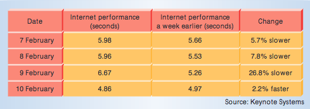

Historia de los ataques DoS
===========================

Durante los últimos años hemos sido testigos de un gran número de ataques de denegación de servicio organizados. La mayor parte de estos ataques proviene de organizaciones hacktivistas, organizaciones criminales o incluso gobiernos.

Estos ataques se han hecho cada vez más profesionales y más efectivos. Desde 1999 que se tiene constancia del primer ataque de denegación de servicio distribuido, contra la universidad de Minnesota, utilizando una botnet formada por 227 máquinas (Garber 2000); hasta hoy en día, con ataques como el de la botnet Mirai, al servidor DNS Dyn, formada por casi 50.000 máquinas. (https://www.jijijaja.com/blog/malware-analysis-mirai-ddos-botnet.html\)

Primeros años (1988 - 1999)
---------------------------

Podemos considerar el primer ataque de denegación de servicio al gusano Morris, en 1988. Creado por Robert Tappan Morris, estudiante de la universidad de Cornell, EEUU. El ataque estaba basado en un programa que se autoreplicaba (gusano) y no en una botnet, como la mayoría de ataques modernos. El objetivo del ataque, según el autor, era calibrar el tamaño de la red, aunque causó una denegación de servicio al 10% (60.000 máquinas) de lo que para entonces la red de telecomunicaciones global, ARPANET, precursora de Internet. El gusano se extendía a través de la explotación de vulnerabilidades en UNIX o a través de contraseñas débiles. Como resultado de este ataque, se fundó en 1988 el centro de coordinación del CERT (CERT/CC), diseñado para proporcionar un punto central para coordinar los distintos equipos de respuesta de emergencia. (https://security.radware.com/ddos-knowledge-center/ddospedia/morris-worm/)  
(https://en.wikipedia.org/wiki/Morris_worm/\)

Respecto a los ataques realizados por botnets, es difícil encontrar cuál fue el primer ataque DDoS a gran escala. Encontramos diferentes artículos del CERT (Computer Emergency Response Team) del año 1996 que ya describen la aparición de diversos ataques distribuidos ese mismo año. (https://www.cert.org/historical/advisories/CA-1996-01.cfm) (https://www.cert.org/historical/advisories/CA-1996-21.cfm\)

El primero de ellos se basa en tomentas de paquetes UDP, creadas mediante la comunicación UDP entre 2 puertos de una o varias máquinas. Cada uno de los puertos UDP genera una salida que se redirige al otro puerto emisor, dando lugar a grandes cantidades de paquetes en la red. El segundo se basa en saturar un host a base de conexiones TCP SYN medio abiertas, ataque conocido como inundación TCP SYN (TCP SYN flood).

También en 1996 apareció el primer exploit basado en el ping de la muerte, capaz de tumbar servidores con un único paquete ICMP *echo request* (ping) malformado. (https://web.archive.org/web/19981205161708/http://www.sophist.demon.co.uk:80/ping/latest.html\)

El primer ataque de denegación de servicio distribuido reportado, a gran escala en Internet, data de agosto de 1999. Se realizó contra la red de la universidad de Minnesota, EEUU. El ataque tumbó la red durante más de dos días. Se utilizó una botnet de 227 máquinas, entre las que había 114 que formaban parte de una red de alta velocidad y capacidad. (Garber 2000)

Por aquella época no eran muy conocidos estos ataques y no tenían mucha difusión. Aquellos que aparecían lo hacían en revistas *underground*. Tampoco había gran variedad de herramientas disponibles y la mayoría eran muy simples o solo pruebas de concepto.

Los primeros escenarios de prueba fueron los canales IRC (Internet Relay Chat). Estos canales de comunicación eran entornos controlados que permitián a los atacantes registrarse anónimamente y enviar mensajes de forma centralizada a las máquinas zombie de las botnets. Por esta razón muchas organizaciones y universidades dejaron de dar soporte a las redes IRC. (Goel, Baykal & Pon 2006)

*Esquema de una botnet utilizando un canal IRC*

El atacante solo necesita enviar los comandos de ataque al canal IRC, al que están conectados todos los bots. En la imagen anterior, el C&C

Investicación y pruebas (2000 - 2006)
-------------------------------------

En febrero del año 2000, durante 3 días, las principales sitios de Internet de la época sufrieron un ataque de denegación de servicio distribuido. Entre ellas se encontraban Yahoo, eBay, CNN Amazon o ZDNet. El autor del ataque fue un chico canadiense de 15 años apodado MafiaBoy. Se le consideró un *script kiddie*, ya que utilizó herramientas que no eran suyas y lanzó el ataque para obtener notoriedad. Utilizó un rootkit automático para infectar máquinas y varias herramientas de denegación de servicio basadas en inundar de tráfico la red realizó el ataque. (Genosko 2006)

Todo comenzó el día 7, con un ataque a Yahoo. Esta web fue la que tuvo mayor número de visitantes legítimos en enero de ese mismo año según Media Metrix, compañia especializada por aquel entonces en medir el tráfico online. Durante los 2 días restantes, otras páginas situadas en el top 50 de visitas únicas al día fueron víctimas del ataque, plataformas de comercio electrónico en su mayoría.

El ataque generó picos de tráfico de 1 gigabit por segundo, superior a lo que podían soportar los servidores, provocando que estuvieran caídos durante horas. Generó pérdidas monetarias en todos los comercios electrónicos afectados y aumentó la latencia de Internet en general. Según un estudio de Keynote Systems, un proveedor de Internet de la época, el día 9 de febrero Internet era un 26,8% más lento. (Garber 2000)

*Comparativa del tráfico durante el ataque y tras el ataque*

En esta fase las técnicas siguen siendo básicas, pero se comienza a investigar y las herramientas empiezan a ser más avanzadas. Tanto que incluso un chico de 15 años pudo realizar un ataque a gran escala sin conocimientos de avanzados de informática. Sobretodo quedo en evidencia que muchas empresas y organizaciones no estaban preparadas ante el nuevo tipo de ataques de denegación de servicio.

**TODO**

En 2004 se publica la primera versión de LOIC una herramienta para hacer DDoS de manera colaborativa. Esta herramienta y algunas de sus variantes han sido utilizadas habitualmente por grupos hacktivistas.

En 2005 se produce el primer ataque DDoS realizado mediante reflexión de DNS.

En 2006 se publican varias herramientas para realizar ataques mediante reflexión de DNS y NTP.

Inicios del cibercrimen (2007 - 2012)
-------------------------------------

Los cibercriminales descubren la facilidad de realizar ataques DDoS y empiezan a monetizar de forma masiva los mismos mediante la extorsión. Los grupos hacktivistas también empiezan a utilizar de forma habitual los ataques DDoS de manera organizada.

Demostrado el gran impacto de esta amenaza, todo el mundo quiere subirse al carro. Por parte de los atacantes, se crean muchos grupos de aficionados y profesionales que quieren sacar partido de este ataque de moda. También aparecen multitud de vendedores de productos y servicios para intentar solventar el problema. Las técnicas empiezan a mejorarse, pero siguen siendo relativamente básicas. Se produce un aumento en el número y la complejidad de las herramientas disponibles.

https://en.wikipedia.org/wiki/2007_cyberattacks_on_Estonia

En abril de 2007 se producen una serie de ataques de DoS coordinados contra Estonia, inundado los sitios web de las principales empresas y organismos. Los ataques fueron realizados mediante Ping floods, Smurf y otros ataques volumétricos. Este fue uno de los primeros ataques masivos atribuidos a una organización criminal promovida por un gobierno.

-	Pushdo botnet / Pandex Botnet 2007 (botnets) https://security.radware.com/ddos-knowledge-center/ddospedia/pushdo-botnet/ https://security.radware.com/ddos-knowledge-center/ddospedia/pandex-botnet/

En 2009 se publica el código original del ataque Slowloris, ataque que demostró la posibilidad de provocar un gran impacto a nivel de aplicación incluso con un bajo flujo de conexiones.

-	Iran ataques ver slowloris

-	Operation Payback 2010 (anon) https://security.radware.com/ddos-knowledge-center/ddospedia/operation-payback/

-	Stuxnet (No DoS pero para concienciar sobre ataque en sistemas críticos, utilizar la doc del curso de Incibe también) 2010 (gobierno?) https://security.radware.com/ddos-knowledge-center/ddospedia/stuxnet/

-	Operation blackout 2012 (anon) https://security.radware.com/ddos-knowledge-center/ddospedia/operation-blackout/

-	Operation Defense 2012 (anon) https://security.radware.com/ddos-knowledge-center/ddospedia/operation-defense/

-	OPIsrael 2012 (anon) https://security.radware.com/ddos-knowledge-center/ddospedia/opisrael/

-	Izz ad-Din al-Qassam Cyber Fighters 2012 (radicales) https://security.radware.com/ddos-knowledge-center/ddospedia/izz-ad-din-al-qassam-cyber-fighters/ https://security.radware.com/ddos-knowledge-center/ddospedia/operation-ababil/

-	LulzSec 2011 - 2012 (anon) https://security.radware.com/ddos-knowledge-center/ddospedia/lulzsec/ https://security.radware.com/ddos-knowledge-center/ddospedia/operation-antisec/

-	TheWikiBoat 2012 (anon) https://security.radware.com/ddos-knowledge-center/ddospedia/thewikiboat/ https://www.infosecurity-magazine.com/news/thewikiboats-opnewson-fires-today/

Fase madurez y actualidad (2013 - 2017)
---------------------------------------

Durante estos años, los cibercriminales ya tienen acceso a una gran variedad de métodos para realizar ataques de denegación de servicio distribuidos. Algunos grupos se han ido especializando, quedan menos grupos, pero son más profesionales.

A principios de 2013 se produce un ataque masivo contra Spamhaus que llega a picos de 85Gbps, generados mayoritariamente mediante amplificación de DNS.

También en 2013 se produce la caída de varios sitios web públicos de la OTAN, debido a un ataque DDoS realizado de forma organizada como resultado de las tensiones sobre Crimea. También atribuido a organizaciones criminales afines al gobierno ruso.

-	Lizard Squad 2014 () organización criminal ataques en 2014 http://blog.elhacker.net/2015/02/estudio-de-akamai-sobre-un-ataque-ddos-del-grupo-lizard-squad.html https://en.wikipedia.org/wiki/Lizard_Squad

En Febrero de 2014 Cloudflare sufre un ataque que llega a picos de 325Gbps, realizado mediante reflexión de NTP.

En abril de 2015 se detecta un ataque que llega a los 334Gbps contra un operador de red de Asia, utilizando también técnicas de amplificación de protocolos UDP.

A finales de 2015 el grupo Anonymous reclama la autoría de un ataque de 40Gbps contra servidores en Turquía, en represalia por su supuesto apoyo al Daesh. Este es uno de los múltiples DDoS organizados por este grupo en los últimos años, aunque no suelen ser ataques demasiado exitosos en comparación con los realizados por organizaciones profesionales.

En enero de 2016 se produce un ataque contra varios sitios asociados a la BBC, alcanzando picos de 602Gbps, supuestamente utilizando servidores hospedados en Amazon AWS.

Mirai https://www.jijijaja.com/blog/malware-analysis-mirai-ddos-botnet.html

Cryptolocker puso de moda el ransom en 2013, aunque ya hubo casos antes 1989, 1996 (teorica) y 2006 https://en.wikipedia.org/wiki/Ransomware_%28malware%29

Ransom WannaCry 2017 (unknown) de nuevo un gusano el ransom se puede considerar dos

Referencias
-----------

Lee Garber, Denial-of-Service Attacks Rip the Internet, Journal Computer, Vol 33, Issue 4, April 2000, pp 12-17, doi:10.1109/MC.2000.839316

Goel, S., Baykal, A., & Pon, D. 2006, 'Botnets: the anatomy of a case', Journal of Information Systems Security. http://www.albany.edu/~goel/publications/botnetbookchapter.pdf

Gary Genosko,The Case of ‘Mafiaboy’ and the Rhetorical Limits of Hacktivism, Fibreculture Journal, Issue 9, 2006 http://nine.fibreculturejournal.org/fcj-057/

http://www.areopago21.org/2016/04/que-ha-pasado-con-los-ddos-repaso.html
