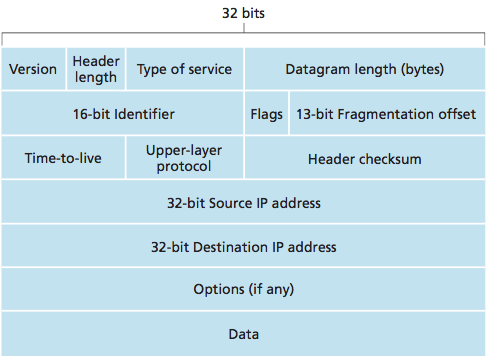
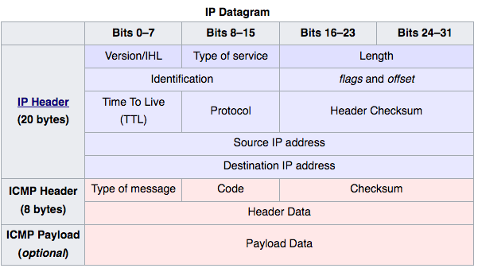
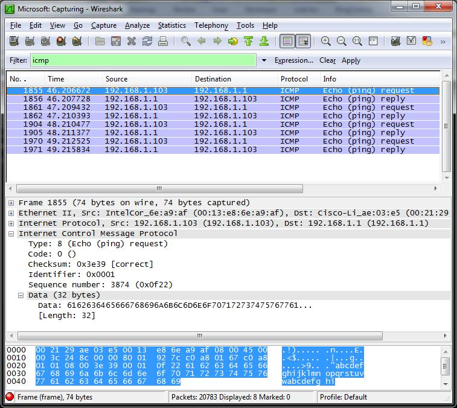
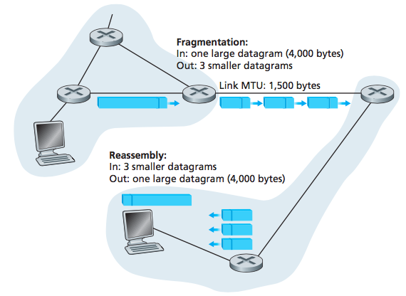

Ping de la muerte
=================

El ping de la muerte (Ping of Death o PoD) es un ataque de denegación de servicio en el que el atacante envía un único paquete de ping malformado con un tamaño inmensamente grande.

El objetivo del ataque es desestabilizar o *crashear* el servidor objetivo, debido a que este no puede procesar todo el paquete, por ejemplo, por un desbordamiento de buffer.

El paquete ping forma parte del protocolo ICMP (Internet Control Message Protocol), que permite enviar y recibir mensajes de control sobre el estado de la red en Internet. Entre los mensajes encontramos ver las direcciones IP de los routers, enviar mensajes de error o descubrir dispositivos en la red, entre otros. El protocolo actúa sobre la capa de red, por lo que el ataque se clasifica en esta misma capa.

Este ataque apareció en las primeras implementaciones de TCP/IP, en 1996. Por aquel entonces muchos sistemas operativos eran vulnerables al ataque, como Windows 95 o Linux 2.x. Además, afectaba a routers, impresoras y otros elementos de la red.

El ataque se parcheó rápidamente para la mayoría de sistemas vulnerables o se implementaron soluciones parciales como el bloqueo de paquetes ICMP a través del cortafuegos. Pese a ello, fue el punto de partida de diferentes ataques de inhundación basados en el protocolo ICMP, como el *ping flood*.

Cabe destacar que este ataque es un ataque al protocolo y no de saturación o inhundación de la red. La implementación del protocolo era errónea, con una vulnerabilidad de desbordamiento de buffer, y debido a ello provocaba la denegación de servicio.

En 2013 apareció una nueva versión basada en IPv6 que afectaba a sistemas desde Windows Vista hasta Windows 8 y Windows Server 2012. Fue parcheada ese mismo año.

Descripción del ataque
----------------------

Los mensajes ICMP se usan para el diagnostico y el control de errores de una red. Estos mensajes se encuentran dentro de paquetes IP, es decir, cuentan con la cabecera característica de un datagrama de red. Aun así, este protocolo sigue perteneciendo a la capa de red y no a la de transporte, situada un nivel por encima. Dentro de la cabecera IP se indica que el tipo de protocolo que encapsula es ICMP poniendo un 1 en el campo protocolo y un 0 en tipo de servicio.

*Formato de un datagrama IPv4*

El contenido de los paquetes ICMP consta de una cabecera con el tipo de mensaje de control, su código y una suma de comprobación o *checksum*. En algunos casos la cabecera tiene un campo variable dependiendo del tipo de ICMP. Además de la cabecera contiene una parte de datos, en la que incluye una copia de la cabecera y los primeros 8 bytes de datos del datagrama IP. Estos datos se utilizan para analizar y clasificar el mensaje a su proceso asociado, por ejemplo, los puertos de la capa de transporte se encuentran en estos primeros 8 bytes.

*Formato de un paquete ICMP*

Un uso típico de este protocolo son los mensajes de ping, implementados a través de los paquetes ICMP *Echo request* y *Echo repy*, que permiten comprobar si una máquina está accesible en la red.

-	Primero se envía un mensaje *Echo request*, tipo 8 y código 0.

-	Si el paquete llega al destino y este lo acepta, contestará con *Echo reply*, tipo 0 y código 0. El contenido de los datos será el mismo que el que haya recibido.

-	Cada vez que el paquete pasa por un router disminuye el valor del campo TTL (Time To Live) en uno. Si el mensaje no llega al destino este campo alcanzará el valor 0. Cuando esto ocurra, el router en el que esté dicho paquete enviará al host emisor un paquete *Destination unreachable*, de tipo 3 y código 1. Indicando que no ha sido posible encontrar el host de destino.

*Captura de una petición y respuesta ICMP con Wireshark*

El campo de datos del paquete ICMP, aunque normalmente solo incluya los 8 bytes mencionados, es de tamaño variable. Este es el punto de partida del ataque ping de la muerte.

El tamaño máximo de un paquete IPv4 correctamente formado es de 65.535 bytes, limitado por el campo longitud de la cabecera IP, que utiliza un entero de 16 bits (216-1).

El verdadero problema reside en la fragmentación de paquetes. La capa de enlace tiene normalmente una limitación en el tamaño de la trama, llamada MTU (Maximun Transmission Unit), de 1500 bytes en el caso de Ethernet. Por tanto, un datagrama IP muy grande es dividido en multiples fragmentos IP. El receptor se encargará de unir dichos fragmentos para generar de nuevo el paquete IP.

Cada fragmento IP necesita llevar información sobre qué offset tiene con respecto al paquete original. Esto se almacena en un campo llamado *Fragment Offset*, en la cabecera IP, cuyo tamaño es de 13 bytes. El offset se mide en múltiplos de 8 bytes.

La fragmentación tiene lugar en los routers situados entre los hosts, pero el ensamblado de dichos fragmentos tiene lugar en la máquina destino. El ping de la muerte consiste en mandar un paquete fragmentado con un tamaño mayor de 65.535, el cual el host destino no será capaz de gestionar.

*Funcionamiento de la fragmentación*

-	El campo de offset para la fragmentación tiene un tamaño de 13 bits. Por tanto, el máximo offset que podemos direccionar es: (213-1)\*8 = 65.528.
-	Si le sumamos la cabecera IP de tamaño 20 bytes, superamos el tamaño máximo de un paquete ICMP: 65.528 + 20 = 65.548

En realidad, si queremos enviar el máximo, 65.535 bytes, significan 65.515 bytes de carga útil y 20 de cabecera. Estos se repartirán en fragmentos de tamaño 1500 bytes con 20 bytes de cabecera y 1480 de carga útil. El total de fragmentos lo podemos obtener con 65.515 / 1480 = 44.2 => 45 fragmentos.

Podemos ver una aproximación con la siguiente tabla:

| Fragmento | Bytes | ID | Offset (Comienzo)      | Flag           |
|-----------|-------|----|------------------------|----------------|
| 1         | 1480  | 1  | 0                      | 1 (Hay más)    |
| 2         | 1480  | 1  | 185 (185*8 = 1480)     | 1 (Hay más)    |
| 44        | 1480  | 1  | 7955 (7955*8 = 63.640) | 1 (Hay más)    |
| 45        | 395   | 1  | 8140 (8140*8 = 65.120) | 0 (No hay más) |

A través de la fragmentación se ha superado el tamaño máximo de un paquete IP. Esto significa que cuando el receptor una todos los fragmentos acabará con un paquete demasiado grande que posiblemente desborde los buffers de memoria que haya reservado para dicho paquete. Si el último paquete supera los 395 bytes dará lugar al desbordamiento.

El problema no tiene nada que ver con el protocolo en si, sino con su implementación, podría suceder en otro tipo de protocolos como TCP, UDP, IGMP, etc.

Características principales
---------------------------

-	Solo es necesario un paquete para realizar el ataque.
-	Es posible falsificar el origen de un paquete ICMP de este tipo.
-	Solo hay que saber la IP de la máquina objetivo.

Mitigación
----------

Para este caso, la solución al problema consiste en añadir comprobaciones en el proceso de reensamblado de fragmentos. Si la suma del offset y la longitud del paquete supera los 65.535 bytes, dicho paquete deberá descartarse. Esta comprobación puede realizarse en el cortafuegos para proteger aquellas máquinas vulnerables al fallo o directamente corrigiendo la vulnerabilidad en los sistemas vulnerables.

Otra posible solución es aumentar el buffer de reensamblado, aunque esto va en contra de la especificación formal del protocolo.

También es posible bloquear todos los mensajes ICMP desde el cortafuegos, aunque a largo plazo no es viable, ya que este ataque podría darse para otro protocolo como FTP, que no fuera productivo bloquear. Además se pierden las funcionalidades básicas de ICMP como el uso de ping.

La medida más inteligente, en caso de no ser posible parchear las máquinas, es bloquear pings fragmentados, permitiendo el tráfico ICMP común.

Realmente, cualquier puerto abierto al exterior es una posible vía para este tipo de ataques. Como se ha indicado, el ataque afecta a la implementación del protocolo, por lo tanto la única medida definitiva es tener actualizados los sistemas a la última versión para evitar vulnerabilidades de ese estilo. Incluso, con esta medida, la aparición de una vulnerabilidad 0-day puede comprometer todos los sistemas.

Referencias
-----------

-	**Funcionamiento**  
	https://web.archive.org/web/19981206105844/http://www.sophist.demon.co.uk/ping/  
	Computer Networking: A Top-Down Approach, 6th Edition, James F. Kurose, Keith W. Ross. https://en.wikipedia.org/wiki/Ping_of_Death  
	https://en.wikipedia.org/wiki/Internet_Control_Message_Protocol

-	**Medidas de mitigación**  
	https://www.incapsula.com/ddos/attack-glossary/ping-of-death.html

-	**Vulnerabilidad en IPv6**  
	https://technet.microsoft.com/en-us/library/security/ms13-065.aspx
