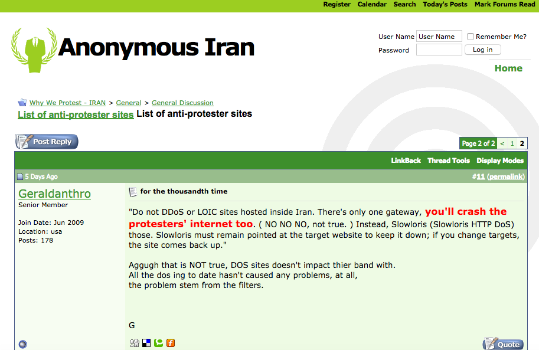
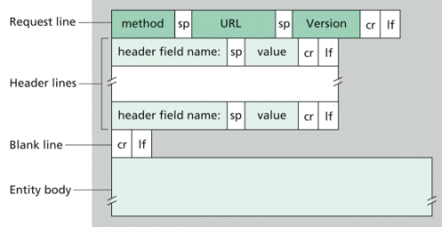

Slow Loris
==========

El ataque Slowloris, desarrollado por Robert “RSnake” Hansen, permite a una sola máquina realizar un ataque de denegación de servicio sobre un servidor web.

Coge su nombre del Loris Perezoso (Slow Loris en inglés), debido a que puede funcionar de forma lenta y continua.


Durante las protestas por las elecciones presidenciales de Irán, en 2009, Anonymous utilizó este ataque de denegación de servicio contra diversos sitios que pertenecían al gobierno iraní. Se eligió este ataque, sobre otros basados en saturar la red, debido a que estos segundos podían afectar tanto a las webs del gobierno como a las webs de los manifestantes. Al elegir este ataque el impacto fue más focalizado e implicaba un menor consumo de ancho de banda.



(https://web.archive.org/web/20090629152805/http://iran.whyweprotest.net/general-discussion/2156-list-anti-protester-sites-2.html) (https://web.archive.org/web/20090811013813/http://iran.whyweprotest.net/help-iran-online/6194-condensed-list-sites-w-pictures-part-1-a.html\)

Descripción del ataque
----------------------

Slowloris se basa en abrir múltiples conexiones en el servidor web objetivo y manteniéndolas durante el máximo tiempo posible. Esto se consigue enviando peticiones HTTP parciales, las cuales jamás se completarán. Puede funcionar enviando peticiones tanto POST como GET.

Los servidores víctima abrirán cada vez más conexiones, esperando por cada una de ellas a que llegue una petición completada.

Al final, el pool de conexiones del servidor alcanzará el máximo posible de sesiones simultáneas, provocando que cualquier conexión adicional (legítima) sea rechazada.

El ataque pertenece a la capa de aplicación. Debido a que los paquetes no estarán malformados, sino que serán parciales, puede evitar fácilmente los IDS tradicionales que actuan sobre la capa 4 (capa de transporte) de la pila OSI.

Lo más característico del ataque es que no requiere muchos recursos para poder efectuarse. Similar al Loris Perezoso https://es.wikipedia.org/wiki/Nycticebus (Slow Loris en inglés, del cuál obtiene su nombre), este ataque puede funcionar de forma lenta y continua, esperando que los sockets del servidor se liberen de una conexión legítima para entonces poder acapararlos.

El ataque también puede ser efectivo en servidores web diseñados para altos volúmenes de tráfico o que reinicien las conexiones legítimas. En ambos casos el ataque será más lento pero, si no es mitigado, efectivo.

Para mantener la actividad constantemente, el ataque simula a un cliente con una conexión muy lenta, el cuál necesita un tiempo muy grande en completar su petición al servidor.

Mientras que haya actividad, el servidor no puede alcanzar ningún límite de inactividad y como el cliente aun no ha acabado la petición, tampoco puede responder. Por tanto el servidor queda en un estado de espera constante por culpa de este cliente lento.

Si se realizan multitud de estas conexiones en paralelo es posible saturar todos los hilos disponibles en el servidor y causar una denegación de servicio.

El ataque se basa en en los campos de la cabecera HTTP. Estos campos se transmiten después de la línea de petición o respuesta, que es la primera línea del mensaje.


Estos campos son pares nombre-valor en texto claro separados por ':' y terminados por '\r\n' (retorno de carro y un salto de línea). El final de la sección de cabecera se indica por un campo vació, por tanto el final de la sección consiste en el envío de dos pares '\r\n' consecutivos.



El ataque slowloris se basa en no enviar el segundo '\r\n', haciendo pensar al servidor que la cabecera está incompleta. A la hora de enviar campos al servidor no importa mucho qué campos enviar. La idea es utilizar el prefijo 'X-', seguido de cualquier texto, utilizado para añadir a la cabecera campos no estándar o personalizados. Como por ejemplo, 'X-file' o 'X-Model'.

Cabecera normal

```
GET / HTTP/1.1\r\n
Host: host\r\n
User-Agent: Mozilla/4.0
Content-Length: 42\r\n
X-a: b\r\n
\r\n
```

Cabecera slowloris

```
GET / HTTP/1.1\r\n
Host: host\r\n
User-Agent: Mozilla/4.0
Content-Length: 42\r\n
X-a: b\r\n
```

Slowloris tiene además algunas características ocultas en su diseño. En primer lugar, puede ser modificado para enviar diferentes cabeceras, haciendo más complicada la correlación de los ataques. En segundo lugar, pero más importante, el fichero del log no será escrito hasta que no sea completada la petición. Esto significa que un servidor puede estar caído durante varios minutos sin que haya una sola entrada en el log advirtiendo del problema. Cuando termine el ataque o cuando se cierre la conexión de un hilo ocurrirán cientos de mensajes 400 en este log. Incluso este defecto se podría mitigar, haciendo que se complete la petición de forma correcta al cabo de cierto tiempo, transformando estos logs en mensajes 200 OK.

Características principales
---------------------------

-	Consume muy poco ancho de banda.
-	Es posible realizarlo con una única máquina.
-	Afecta únicamente al servicio web atacado, con casi ningún efecto lateral en otros servicios y puertos.

Mitigación
----------

La medida de mitigación principal se basa en el uso de un proxy inverso capaz de inspeccionar todas las peticiones entrantes a los servidores, bloqueando cualquier petición parcial.

También se pueden utilizar técnicas a nivel de configuración del servidor web para mitigar o reducir el efecto del ataque:

-	Limitar el numero de conexiones establecidas por una dirección IP.
-	Establecer restricciones de mínimo de velocidad de transferencia.
-	Establecer restricciones en la longitud de tiempo que un cliente está conectado (mantiene un hilo ocupado).

Debido a que Apache es uno de los principales servidores afectados, dispone de gran variedad de módulos para limitar este ataque, como son:

-	**mod_limitipconn** y **mod_noloris** Limitan el número de conexiones realizadas por una IP.

-	**mod_reqtimeout** Establece límites y mínimos de tasa de transferencia de datos para las peticiones entrantes.

-	Otros módulos útiles son **mod_qos**, **mod_evasive**, **mod_security** y **mod_antiloris**.

Referencias
-----------

-	**Funcionamiento**  
	https://www.incapsula.com/ddos/attack-glossary/slowloris.html https://isc.sans.edu/forums/diary/Apache+HTTP+DoS+tool+released/6601/http://security.stackexchange.com/questions/86298/rsnakes-slow-loris-tool https://security.stackexchange.com/questions/86298/rsnakes-slow-loris-tool https://en.wikipedia.org/wiki/List_of_HTTP_header_fields https://web.archive.org/web/20150315054838/http://ha.ckers.org/slowloris/

-	**Medidas de mitigación**  
	https://isc.sans.edu/forums/diary/Apache+HTTP+DoS+tool+mitigation/6613/http://www.techrepublic.com/blog/smb-technologist/secure-your-apache-server-from-ddos-slowloris-and-dns-injection-attacks/ https://en.wikipedia.org/wiki/Slowloris_(computer_security\)

-	**Herramienta**  
	https://github.com/gkbrk/slowloris/blob/master/slowloris.py
