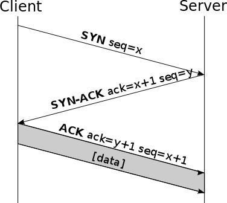

TCP SYN FLOOD
=============

El ataque TCP SYN flood o inundación TCP SYN (usualmente llamado SYN-flood) es un ataque de denegación de servicio distribuido que explota el funcionamiento básico del protocolo TCP para consumir los recursos en el servidor objetivo y dejarlo inutilizado.

El atacante envía peticiones de conexión TCP al objetivo a una velocidad superior a la que el servidor es capaz de procesarlas, causando una saturación en la red.

Este ataque ha sido utilizado **TODO** LOIC

Descripción del ataque
----------------------

Para establecer una sesión TCP es necesaria una negociación en 3 pasos (3-way handshake). El funcionamiento básico de este intercambio en 3 pasos es el siguiente:

-	Primero, el cliente solicita una conexión al servidor enviando un paquete con el flag SYN activado.
-	En segundo lugar, el servidor acepta la conexión enviando un paquete de vuelta al cliente con los flags SYN y ACK activados.
-	Finalmente, el cliente responde con un paquete con el flag ACK. A partir de entonces la conexión se da por establecida y podrá enviar datos al servidor.

En un ataque SYN flood, el atacante envía de forma repetida paquetes SYN a cada uno de los puertos del servidor. Normalmente se utilizan direcciones IP *spoofeadas* o falsificadas, aunque es posile utilizar botnets de máquinas con direcciones únicas y reales. El servidor tomará cada una de estos paquetes como peticiones legítimas y responderá a cada de una de ellas con un paquete SYN-ACK, por cada puerto abierto.

El cliente malicioso nunca enviará el paquete ACK final para cerrar la negociación en 3 pasos, de esta forma el servidor se quedará esperando a establecer esta conexión durante cierto tiempo.

**TODO Check** During this time, the server cannot close down the connection by sending an RST packet, and the connection stays open.  
**TODO Check**

Antes de que la conexión del servidor expire el cliente malicioso enviará otro paquete SYN, dando lugar a un gran número de conexiones medio-abiertas.

El resultado final será que las tablas de conexiones del servidor se llenarán, denegando el servicio a los clientes legítimos y provocando que el servidor se ralentice o se detenga.

**TODO**

Características principales
---------------------------

Mitigación
----------

**TODO**

-	IDS?
-	IPS?
-	Firewall?
-	Balancear carga??
-	Micro blocks
-	SYN cookies
-	RST cookies
-	Medidas sobre protocolo TCP
	-	Reducir timeout
	-	Drop de conexiones

Todo lo anterior depende de la capacidad de manegar grandes volumenes de trafico

Hay más soluciones

-	Alguien que se ponga delante y se trague el ataque por ti
	-	Cuanto más cerca del ataque mejor
	-	Llevar el tráfico a redes secundarias
	-	Escalar cuanto más tráfico

Son soluciones caras

Micro blocks—administrators can allocate a micro-record (as few as 16 bytes) in the server memory for each incoming SYN request instead of a complete connection object.

SYN cookies—using cryptographic hashing, the server sends its SYN-ACK response with a sequence number (seqno) that is constructed from the client IP address, port number, and possibly other unique identifying information. When the client responds, this hash is included in the ACK packet. The server verifies the ACK, and only then allocates memory for the connection.

RST cookies—for the first request from a given client, the server intentionally sends an invalid SYN-ACK. This should result in the client generating an RST packet, which tells the server something is wrong. If this is received, the server knows the request is legitimate, logs the client, and accepts subsequent incoming connections from it.

Stack tweaking—administrators can tweak TCP stacks to mitigate the effect of SYN floods. This can either involve reducing the timeout until a stack frees memory allocated to a connection, or selectively dropping incoming connections.

Obviously, all of the above mentioned methods rely on the target network's ability to handle large-scale volumetric DDoS attacks, with traffic volumes measured in tens of Gigabits (and even hundreds of Gigabits) per second.

Referencias
-----------

-	**Descripción**  
	https://www.incapsula.com/ddos/attack-glossary/syn-flood.html

-	**TCP handshake**  
	https://es.wikipedia.org/wiki/Transmission_Control_Protocol
