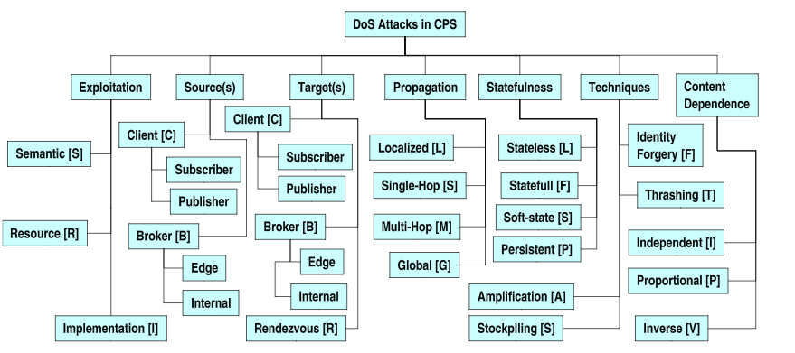

Diferentes taxonomías
=====================

La clasificación de los ataques de denegación de servicio siempre ha sido un tema muy complejo, debido a la gran variedad de ataques que existen y que pueden afectar a muchos niveles y de muchas formas. Una taxonomía o clasificación nos permite identificar los activos sobre los que puede afectar un ataque de denegación de servicio. Así, nos será más fácil entender cómo funciona un ataque en concreto y qué mecanismos podemos utilizar para mitigarlo.

Durante estos años se ha intentado recopilar todos los ataques en una única taxonomía, dando lugar a complejos diagramas con decenas de clasificaciones. (Mirkovic & Reiher 2004) (Wun, Cheung & Jacobsen 2007)

**TODO** podría poner algo mas aquí de la segunda taxo

*Taxonomía diseñada por Wun, Cheung y Jacobsen en 2007*

No se ha encontrado aun una clasificación taxonómica lo suficientemente completa, sencilla, que cubra todos los ataques DoS conocidos hasta la fecha y facilite la tarea de tomar medidas de mitigación frente al ataque. Por tanto, en este apartado se expondrán diferentes taxonomías con las que se intentará definir un ataque de denegación de servicio de esta forma. Para ello se utilizarán diversas clasificaciones realizadas por varios autores.

En primer lugar, se utilizará una simplificación de la taxonomía proporcionada por Gerardo García Peña en su conferencia *DoS: Un enfoque práctico*, en la Rooted CON 2012. Esta clasificacón toma ideas de las otras dos ya mencionadas de 2004 y 2007. (García Peña 2012)

También se utilizará otra taxonomía basada en la pila OSI, que divide los ataques según la capa de protocolos a la que afectan. Esta clasificación ha sido propuesta por el US-CERT, la máxima autoridad en tareas de ciberdefensa nacional en EEUU.https://www.us-cert.gov/sites/default/files/publications/DDoS%20Quick%20Guide.pdf

Forma de ser lanzado
--------------------

**TODO**  
En cada una, definir, poner los tipos (definir) y ejemplos (con sus referencias)

-	Botnet  
	IRC, P2P, ...  
-	Gusano  
	Formas de expandir el gusano https://www.researchgate.net/publication/277306147_A_Broad_Overview_of_Denial_of_Service_Attack

Factor de impacto
-----------------

Podemos considerar el factor de impacto que tiene el ataque en la organización.

-	**Degradación.** Solo hay una degraciación del servicio, no una denegación completa. Por ejemplo, el aumento de latencia en un ataque slowloris. El ataque intenta acaparar todos los hilos de un servidor web. Si este tiene demasiados, puede simplemente ocupar una parte y disminuyendo el rendimiento de respuestas legítimas.

-	**Disruptivo.** En este caso la denegación de servicio sería completa.

	-	**Auto recuperable.** El sistema es capaz de recuperarse solo después del ataque. Por ejemplo si hay programas *watchdog*, que vigilan que el servicio está funcionando y si no es así lo relanzan.

	-	**Humano recuperable.** Es necesaria la interacción humana para relanzar el servicio. Si el sistema queda inestable y hace falta que una persona lo reinicie manualmente.

	-	**No recuperable.** El sistema queda dañado gravemente y es necesario reconstruirlo. Como el gusano Stuxnet, que podía gestionar la velocidad de las turbinas de una planta nuclear, pudiendo acelerar y decelerar constantemente para dañar seriamente las piezas.

Caracterizable
--------------

**TODO**  
- Filtrable  
- No filtrable  
- No caracterizable

Rate
----

**TODO**

-	One shot  
-	Constante  
-	Variable

	-	Fluctante  
	-	Incremental

Mecanismo de explotación
------------------------

Podemos clasificar según el mecanismo que se utilice para realizar la denegación de servicio.

-	**Limitación de recursos.** La víctima recibe más recursos de los que puede soportar. Todos los ataques de inundación de paquetes se encuentran en este apartado, pero también ataques que limiten cualquier recurso de la víctima, ya sea CPU, disco e incluso el acceso a los datos, como los ransomware.

-	**Debilidad semántica.** Explota una característica legítima de una máquina o un protocolo, que no sean seguros, para realizar la denegación de servicio. El ARP spoofing es un buen ejemplo, ya que aprovecha una característica legítima, que es un mensaje opcional para darse a conocer en la red.

-	**Fallo de implementación.** Explota una vulnerabilidad en la implementación de un servicio o protocolo para detener funcionamiento normal de la víctima. Un ejemplo es el ping de la muerte, que explotando un desbordamiento de buffer por una mala implementación del protocolo ICMP causaba que la máquina víctima *crasheara*.

Capa del modelo OSI
-------------------

Mediante este enfoque podemos clasificar los ataques según la capa del intercambio de datos entre dos máquinas. Se considera esta taxonomía una de los más completas y simples, unificándose con la estandarización de protocolos y el modelo OSI. Debido a esto, se ha realizado un sólo apartado para esta clasificación.

[Clasificación según el modelo OSI](./clasificacion_OSI.md)

Referencias
-----------

Jelena Mirkovic, Peter Reiher, A Taxonomy of DDoS Attack and DDoS Defense Mechanisms, 2004

Alex Wun, Alex Cheung & Hans-Arno Jacobsen, A Taxonomy for Denial of Service Attacks in Content-based Publish/Subscribe Systems, 2007

Gerardo García Peña, DoS: Un enfoque práctico, Rooted CON 2012 https://www.slideshare.net/rootedcon/gerardo-garca-pea-enfoque-prctico-a-la-denegacin-de-servicio-rooted-con-2012

US-CERT, DDoS Quick Guide, 2014 https://www.us-cert.gov/sites/default/files/publications/DDoS%20Quick%20Guide.pdf
